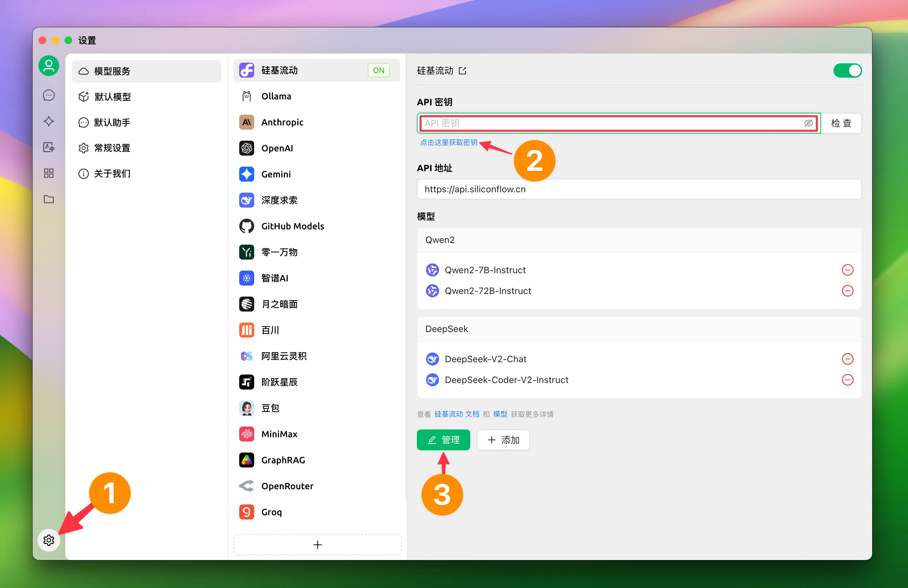
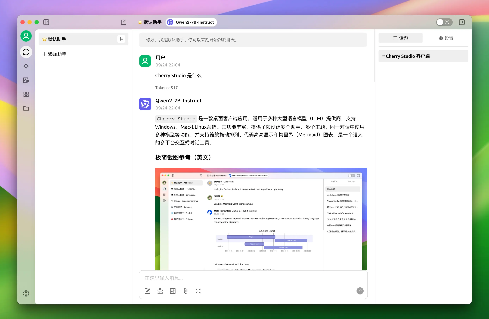

# SiliconCloud 配置

## 设置 API 密钥

1. 点击左下角的设置
2. 点击链接获取密钥
3. 点击管理添加模型

## 开始聊天

1. 点击左侧菜单栏的“对话”按钮
2. 在输入框内输入文字即可开始聊天
3. 可以选择顶部菜单中的模型名字切换模型

## 安装教程

Windows 安装：[https://cherry-ai.com/docs/windows-install](https://cherry-ai.com/docs/windows-install)  
macOS 安装：[https://cherry-ai.com/docs/mac-install](https://cherry-ai.com/docs/mac-install)
