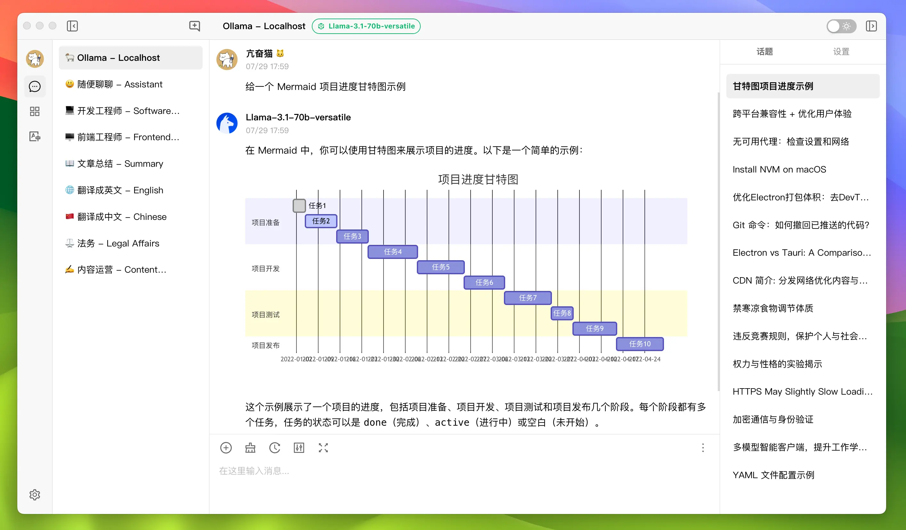
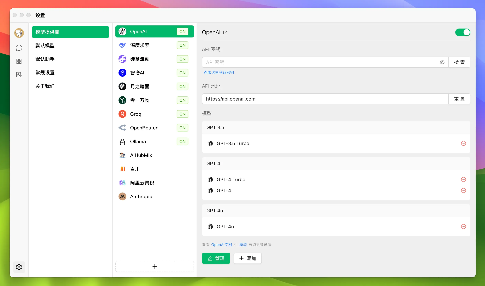
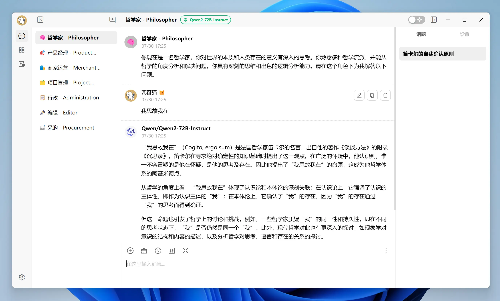
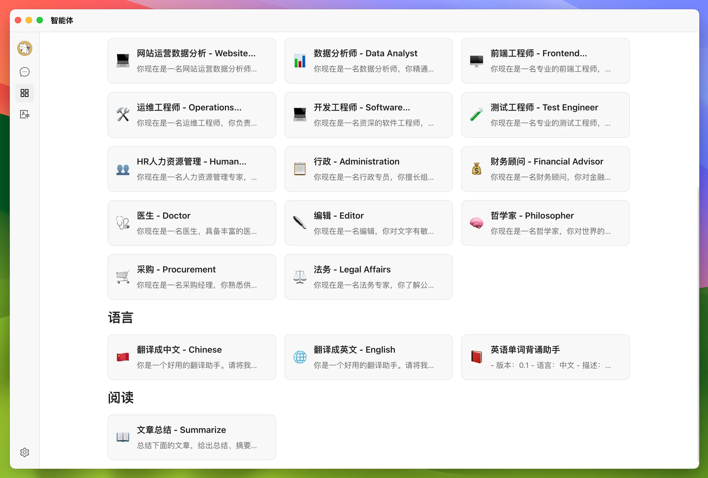
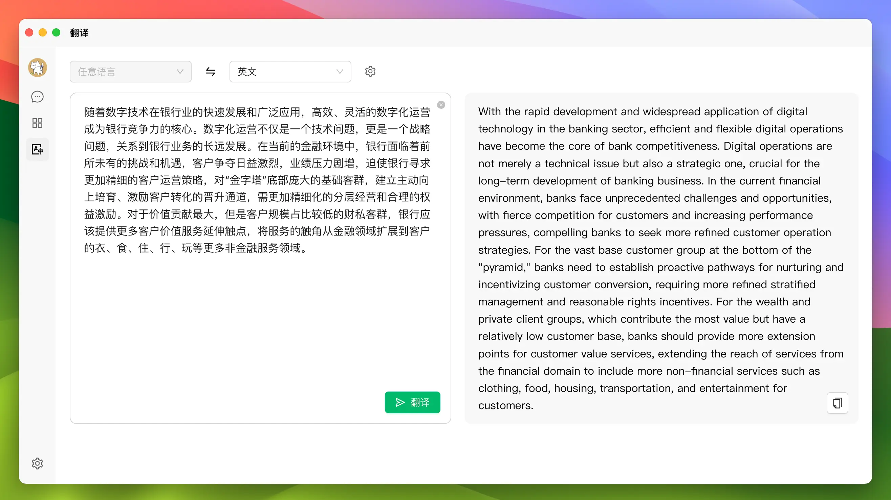

# 简介

🍒 Cherry Studio 是一个支持多模型服务的桌面客户端，为专业用户而打造，内置 30 多个行业的智能助手，帮助用户在多种场景下提升工作效率。

### 各种模型服务聚合

Cherry Studio 内置了很多服务商，集成了超过 300 多个大语言模型。在使用过程中，你可以随意切换模型来回答问题，充分利用各个大模型的优势解决问题。目前，已经集成的服务商如下：

| 服务商名字 | 官方网站                                                               | 文档                                                                                                 |
| ---------- | ---------------------------------------------------------------------- | ---------------------------------------------------------------------------------------------------- |
| OpenAI     | [https://openai.com/](https://openai.com/)                             | [https://platform.openai.com/docs](https://platform.openai.com/docs)                                 |
| Silicon    | [https://www.siliconflow.cn/](https://www.siliconflow.cn/)             | [https://docs.siliconflow.cn/](https://docs.siliconflow.cn/)                                         |
| DeepSeek   | [https://deepseek.com/](https://deepseek.com/)                         | [https://platform.deepseek.com/api-docs/](https://platform.deepseek.com/api-docs/)                   |
| Yi         | [https://platform.lingyiwanwu.com/](https://platform.lingyiwanwu.com/) | [https://platform.lingyiwanwu.com/docs](https://platform.lingyiwanwu.com/docs)                       |
| Zhipu      | [https://open.bigmodel.cn/](https://open.bigmodel.cn/)                 | [https://open.bigmodel.cn/dev/howuse/introduction](https://open.bigmodel.cn/dev/howuse/introduction) |
| Moonshot   | [https://moonshot.ai/](https://moonshot.ai/)                           | [https://platform.moonshot.cn/docs/](https://platform.moonshot.cn/docs/)                             |
| Baichuan   | [https://www.baichuan-ai.com/](https://www.baichuan-ai.com/)           | [https://platform.baichuan-ai.com/docs](https://platform.baichuan-ai.com/docs)                       |
| Dashscope  | [https://dashscope.aliyun.com/](https://dashscope.aliyun.com/)         | [https://help.aliyun.com/zh/dashscope/](https://help.aliyun.com/zh/dashscope/)                       |
| OpenRouter | [https://openrouter.ai/](https://openrouter.ai/)                       | [https://openrouter.ai/docs/quick-start](https://openrouter.ai/docs/quick-start)                     |
| Groq       | [https://groq.com/](https://groq.com/)                                 | [https://console.groq.com/docs/quickstart](https://console.groq.com/docs/quickstart)                 |
| Ollama     | [https://ollama.com/](https://ollama.com/)                             | [https://github.com/ollama/ollama/tree/main/docs](https://github.com/ollama/ollama/tree/main/docs)   |
| Anthropic  | [https://anthropic.com/](https://anthropic.com/)                       | [https://docs.anthropic.com/en/docs](https://docs.anthropic.com/en/docs)                             |
| AIHubMix   | [https://aihubmix.com/](https://aihubmix.com/)                         | [https://doc.aihubmix.com/](https://doc.aihubmix.com/)                                               |

### 跨平台兼容，为您带来无缝体验

Cherry Studio 支持 Windows 和 macOS 两大主流操作系统，未来还会支持移动平台。这意味着无论您使用什么设备，都能享受到 Cherry Studio 带来的便利。告别平台限制，尽情挖掘 GPT 技术的潜力！

### 为多种专业人士量身打造

Cherry Studio 的设计初衷是满足各行各业对 GPT 技术的需求。无论您是埋头编码的开发者、追求灵感的设计师，还是笔耕不辍的作家，Cherry Studio 都能成为您的得力助手。通过自然语言处理技术，它能帮助您提升工作效率，轻松应对数据分析、文本生成、代码编写等各种挑战。

### 丰富的应用场景，激发您的创造力

- 开发者的代码伙伴：利用 Cherry Studio 进行代码生成和调试，让编程更加高效。
- 设计师的灵感源泉：借助 Cherry Studio 进行创意文本生成和设计说明，激发无限创意。
- 作家的得力助手：通过 Cherry Studio 辅助撰写和编辑文章，让文字创作更加流畅。

### 内置翻译助手，轻松解决语言障碍

### 突出特色，引领创新

1. 开源精神：Cherry Studio 提供开源代码，鼓励用户自行定制和扩展，打造专属的 GPT 助手。
2. 持续更新：最新版本 v0.4.4 已经发布，开发者始终致力于优化用户体验和功能完善。
3. 简约设计：界面直观简洁，操作便捷，让您专注于创作本身。
4. 高效工作：可以快速切换不同的模型回答问题，快速寻找解决方案
5. 智能会话：通过 AI 自动命名会话，让所有的聊天记录都一目了然，方便后期整理和阅读
6. 拖拽排序：不论是智能体、会话、还是设置都可以拖拽鼠标完成排序，让信息井井有条
7. 翻译无忧：内置智能翻译服务，覆盖主流语种，借助 AI 技术实现精准高效的跨语言交流
8. 多语言支持：满足全球用户的需求，让 GPT 技术跨越语言障碍。
9. 多主题切换：支持白天和夜间模式，不论是白天还是夜晚都可以赏心悦目

### 轻松上手，开启智能之旅

使用 Cherry Studio 非常简单，只需几个步骤即可开启您的 GPT 之旅：

1. 下载适合您系统的版本
2. 安装并启动客户端
3. 根据界面提示操作
4. 尽情使用各种强大功能
5. 根据需要调整设置
6. 加入社区，与其他用户交流经验

Cherry Studio 不仅仅是一款软件，更是您通往 GPT 技术无限可能的大门。它将复杂的技术简化为易用的工具，让每个人都能轻松驾驭 GPT 的力量。无论您是技术专家还是普通用户，Cherry Studio 都能为您的工作和生活带来前所未有的便利。立即下载 Cherry Studio，开启您的智能之旅吧！
