# 知识库教程

在 0.91 版本中，CherryStudio 带来了期待已久的知识库功能。

下面我们将按步骤呈现 CherryStudio 的详细使用说明。

# 添加嵌入模型

1. 在模型管理服务中查找模型，可以点击“嵌入模型”快速筛选；
2. 找到需要的模型，添加到我的模型。

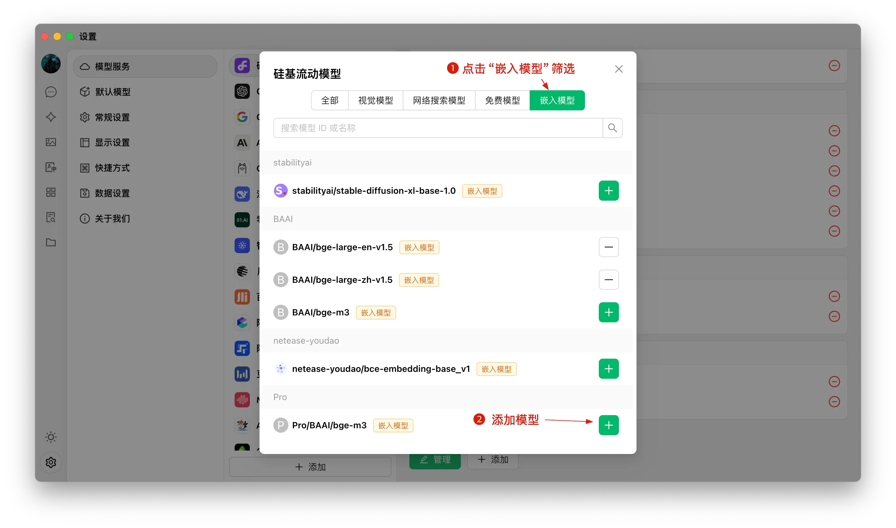

# 创建知识库

1. 知识库入口：在 CherryStudio 左侧工具栏，点击知识库图标，即可进入管理页面；
2. 添加知识库：点击添加，开始创建知识库；
3. 命名：输入知识库的名称并添加嵌入模型，以 bge-m3 为例，即可完成创建。

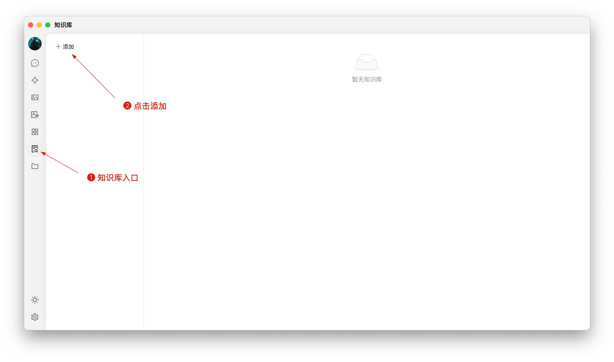

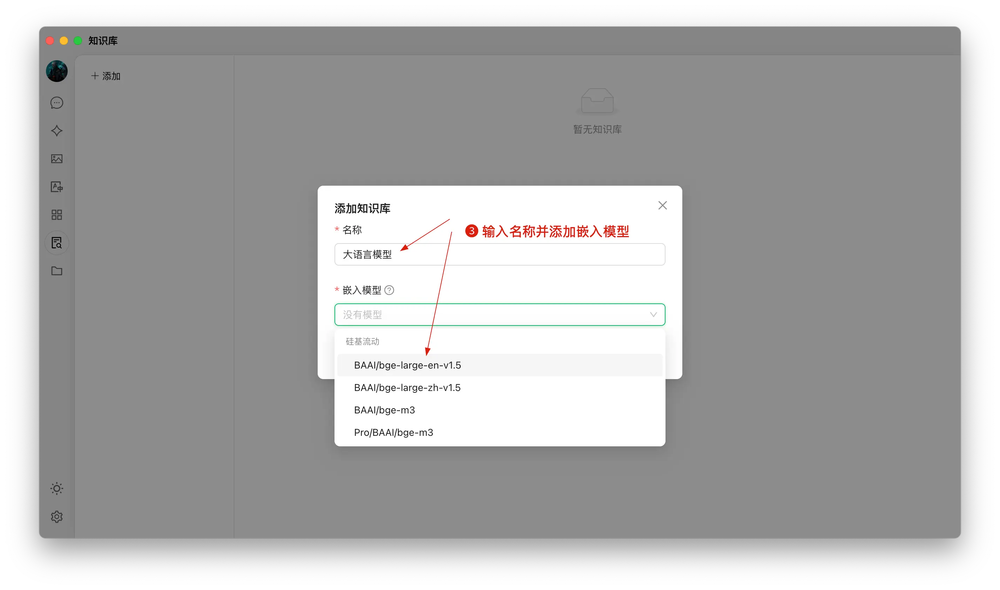

# 添加文件并向量化

1. 添加文件：点击添加文件的按钮，打开文件选择；
2. 选择文件：选择支持的文件格式，如 pdf，docx，pptx，xlsx，txt，md，mdx 等，并打开；
3. 向量化：系统会自动进行向量化处理，当显示完成时（绿色 ✓），代表向量化已完成。

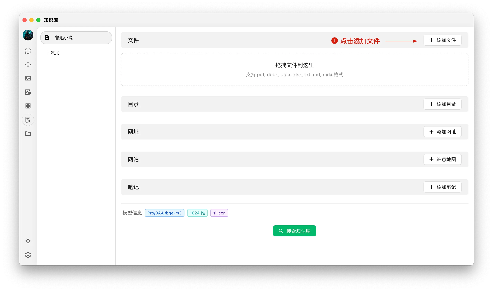

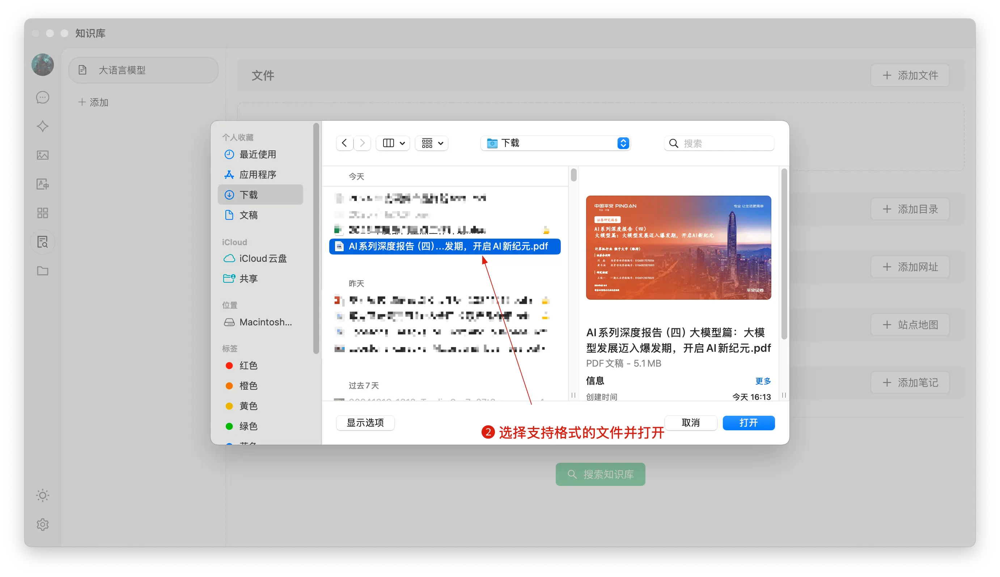

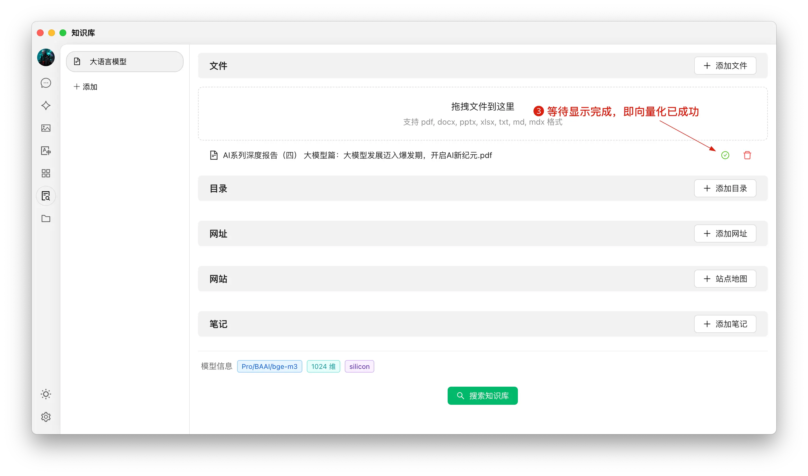

# 添加多种来源的数据

CherryStudio 支持多种添加数据的方式：

1. 文件夹目录：可以添加整个文件夹目录，该目录下支持格式的文件会被自动向量化；
2. 网址链接：支持网址 url，如[https://docs.siliconflow.cn/introduction](https://docs.siliconflow.cn/introduction)；
3. 站点地图：支持 xml 格式的站点地图，如[https://docs.siliconflow.cn/sitemap.xml](https://docs.siliconflow.cn/sitemap.xml)；
4. 纯文本笔记：支持输入纯文本的自定义内容。

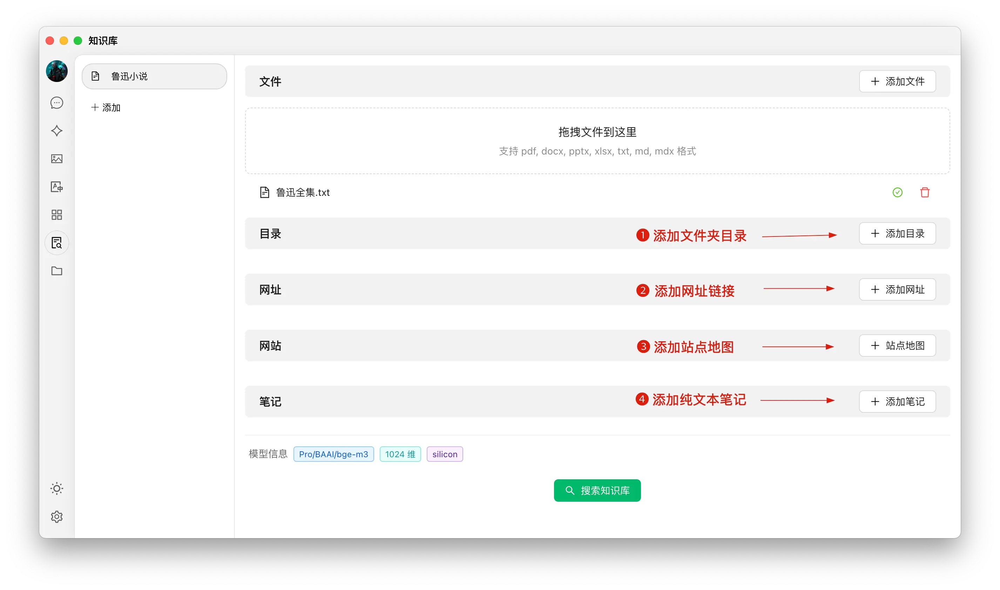

# 搜索知识库

当文件等资料向量化完成后，即可进行查询：

1. 点击页面下方的搜索知识库按钮；
2. 输入查询的内容；
3. 呈现搜索的结果；
4. 并显示该条结果的匹配分数。

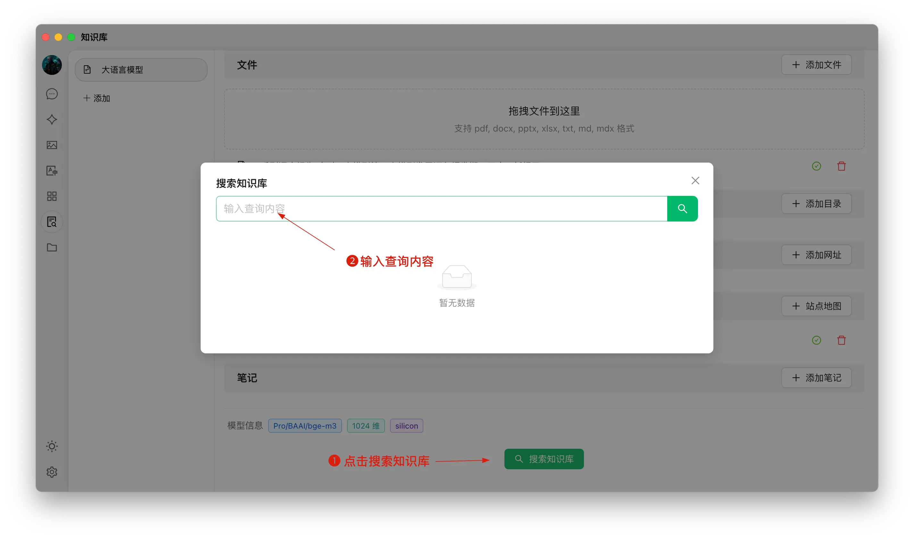

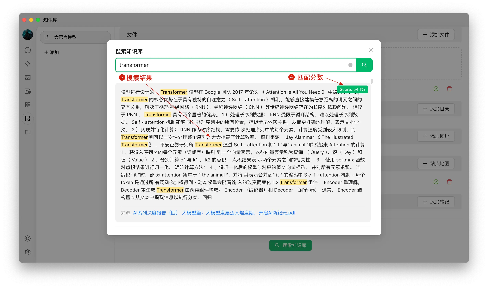

# 对话中引用知识库生成回复

1. 创建一个新的话题，在对话工具栏中，点击知识库，会展开已经创建的知识库列表，选择需要引用的知识库；
2. 输入并发送问题，模型即返回通过检索结果生成的答案 ；
3. 同时，引用的数据来源会附在答案下方，可快捷查看源文件。

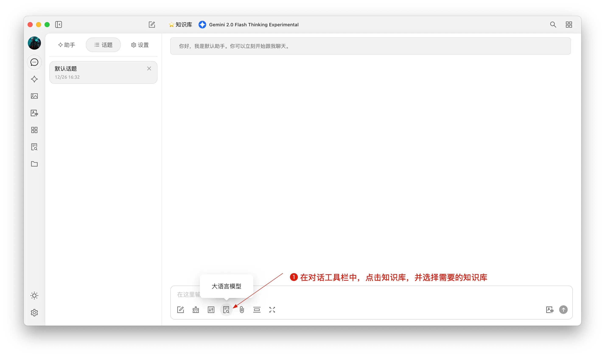

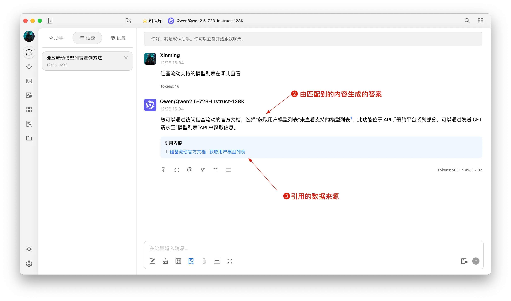

# 结语

在 LLM 技术浪潮中，CherryStudio 顺应趋势，推出知识库与 RAG 功能，注入更卓越的检索与信息调用能力，也进一步拓宽了 CherryStudio 在多元生产力场景中的应用版图。

诚然，受限于现阶段语言模型的基础能力，体验尚未臻于完美，但随着技术的不断迭代革新，RAG 技术必将成为 AI 应用的明珠，未来可期。
